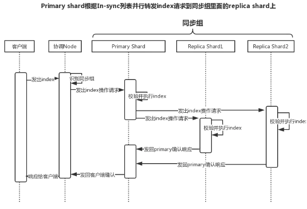
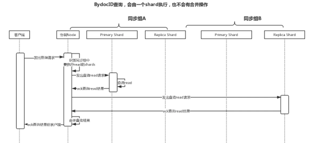

## 1 安装

基于docker安装

### 1.1  下载镜像  

```
   docker pull elasticsearch:6.7.0
   docker pull mobz/elasticsearch-head:5
   docker pull kibana:6.7.0
```
###1.2 启动es镜像

```
#es默认启动内存2G 本机启动可限制一下
docker run --name elasticsearch -p 9200:9200 -p 9300:9300 -e  "ES_JAVA_OPTS=-Xms512m -Xmx512m"  -d 02982be5777d
```

elasticsearch服务有跨域问题，导致elasticsearch-head无法连接到ES，因此需要进入ES容器修改配置

进入容器   docker exec -it elasticsearch /bin/bash  

https://www.cnblogs.com/vincenshen/p/10872372.html

config/elasticsearch.yml

```
http.cors.enabled: true
http.cors.allow-origin: "*"
```

配置完成后重启es:   docker restart elasticsearch

###1.3  启动head

```
docker run -d --name head -p 9100:9100 mobz/elasticsearch-head:5
```

关于head不能搜索的问题处理:elasticsearch 后续增加了请求头严格校验,因此修改下head配置 

https://blog.csdn.net/u012760564/article/details/108089589

###1.4 启动kibana

```
#docker inspect elasticsearch  查看容器元数据,获取es容器暴露的ip172.17.0.2
#参考博客:https://blog.csdn.net/jacksonlee313/article/details/107264367/
docker run --name kibana -e ELASTICSEARCH_URL=http://172.17.0.2:9200 -p 5601:5601 -d a674d23325b0
```

在kibana 安装好之后,访问出现 Kibana server is not ready yet

1  kibana和elasticsearch的版本要一致

2 如果版本一致依然出现,多刷新几次,等待其启动

docker logs -f -t --tail 10 kibana  查看kibana启动日志

3 如果之前仍然不成功,可配置kinaba.yml

```
docker exec -it kibana /bin/bash
vi /usr/share/kibana/config/kibana.yml
```


###1.5 路径

http://127.0.0.1:9100    es监控插件head
http://127.0.0.1:9200      es
http://127.0.0.1:5601     kibana


###1.6 安装IK

安装ik(注意版本)       参考博客 :  https://www.cnblogs.com/szwdun/p/10664348.html

<https://github.com/medcl/elasticsearch-analysis-ik/releases/tag/v6.7.0>     ik分词器的下载地址

```
./bin/elasticsearch-plugin install https://github.com/medcl/elasticsearch-analysis-ik/releases/download/v6.7.0/elasticsearch-analysis-ik-6.7.0.zip
```

### 1.7 ElasticSearch-sql安装

https://www.cnblogs.com/kangoroo/p/7273493.html

在线安装: 安装注意和es保持版本一致

```
docker exec -it elasticsearch /bin/bash
```

```
./bin/elasticsearch-plugin install https://github.com/NLPchina/elasticsearch-sql/releases/download/6.7.0.0/elasticsearch-sql-6.7.0.0.zip
```


## 2  ES 介绍

###2.1 是什么

- elasticsearch是一个基于Lucene的高扩展的分布式搜索服务器，支持开箱即用。  
- elasticsearch隐藏了Lucene的复杂性，对外提供Restful 接口来操作索引、搜索。 


###2.2  优势

- 横向可扩展: 只需要增加一台服务器,做一些配置,启动ES进程就可以并入集群
- 高可用: 提供副本机制,一个分片可以设置多个副本,使得某服务器在宕机的的情况下依 然可以照常运行.
- 易维护: 开箱即用,文档全面
- 高性能:  尽实时搜索,支持处理PB级的数据

### 2.3 术语

1索引词(term) 

2 文本(text)    

3 分析(analysis)

4 集群(cluster)


5 节点(node)

7 分片(shard)

8 主分片(primary shard)   :  文档会首先存储在主分片上,然后复制到不同的副本中

9 副本分片(replica shard) :  主分片的复制

10 复制(replica)

11 索引(index)

12 类型(type)

13 文档(document)

14 映射(mapping)

15 字段(field)


16 来源字段(source field)  :存储原文档


### 2.4 ES数据复制模型

参考:<https://www.jianshu.com/p/98d96964a45e> 

ES里面的每一个索引（Index）由多个shard组成，每一个shard有多个副本。这些副本被称为"同步组"。当增加或者删除文档时，这些副本之间必须保持同步，以便让所有副本都能包含相同的文档。如果同步失败，有可能会导致从一个副本读的结果和从另外一个副本上读的结果不一致。在shard的所有副本之间保持数据同步并同时对外提供一致的读服务，我们这样的处理过程称之为“数据复制模型"。


#### 2.4.1 基本写模型



#### 2.4.2 基本读模型



同时出现读写?  


### 2.5 容灾

<https://www.cnblogs.com/hello-shf/p/11543468.html#_label4> 

#### 2.5.1 集群容灾

ES监控类的API有三类:

- 集群相关 ,以_cluster开头
- 监控节点相关,以_nodes开头
- 以任务相关,以_task开头

例如:  监控集群状态


- green:所有主分片和副本分片都出于活动状态
- yellow:所有主分片都出于活动状态,有些副本分片出于未活动状态
- red:不是所有的主分片都处于活动状态


假设node1发生宕机，也就是master节点发生宕机。此时集群的健康状态为red 

具体的容灾：

1，重新选举master节点，当es集群中的master节点发生故障，此时es集群将再次进行master的选举，选举出一个新的master节点。假设此时新的主节点为node2。

2，node2被选举为新的master节点，node2将作为master行驶其分片分配的任务。

3，replica shard升级，此时master节点会寻找node1节点上的P0分片的replica shard，发现其副本在node2节点上，然后将R0提升为primary shard。这个升级过程是瞬间完成的，就像按下一个开关一样。因为每一个shard其实都是lucene的实例。此时集群如下所示，集群的健康状态为yellow，因为不是每一个replica shard都是active的。


#### 2.5.2 分片和副本

1, ES不允许Primary和它的Replica放在同一个节点中（为了容错），并且同一个节点不接受完全相同的两个Replica，也就是说，因为同一个节点存放两个相同的副本既不能提升吞吐量，也不能提升查询速度，徒耗磁盘空间。

2 每台节点的shard数量越少，每个shard分配的CPU、内存和IO资源越多，单个shard的性能越好，当一台机器一个Shard时，单个Shard性能最好。

3 相同资源分配相同的前提下，单个shard的体积越大，查询性能越低，速度越慢

4 稳定的Master节点对于群集健康非常重要,理论上讲，应该尽可能的减轻Master节点的压力，分片数量越多，Master节点维护管理shard的任务越重，并且节点可能就要承担更多的数据转发任务，可增加“仅协调”节点来缓解Master节点和Data节点的压力，但是在集群中添加过多的仅协调节点会增加整个集群的负担，因为选择的主节点必须等待每个节点的集群状态更新确认。

### 2.6 扩容

#### 2.6.1 垂直扩容

垂直扩容是升级服务器，买性能更好的，更贵的然后替换原来的服务器

#### 2.6.2 水平扩容

水平扩容是增加服务器的数量，这种扩容方式可持续性强，将众多普通服务器组织到一起就能形成强大的计算能力 

### 2.7.2 节点对等,master节点,协调节点

节点对等:

```
节点对等就是在集群中每个节点扮演的角色都是平等的，也就意味着每个节点都能成为集群的流量入口，当请求进入到某个节点，该节点就会暂时充当协调节点的角色，对请求进行路由和处理。这是一个区别于其他分布式中间件的很重要的特性。节点对等的特性让elasticsearch具备了负载均衡的特性。在后面对document的写入和搜索会详细介绍该牛叉的特性。
```

master节点: 

```
1 集群层面的设置
2 集群内的节点维护
3 集群内的索引、映射（mapping）、分词器的维护
4 集群内的分片维护
```

协调节点:

```
协调节点其实就是请求命中的那个节点。该节点将承担当前请求的路由工作。 
```


##3 CRUD

### 3.1 创建mappings

PUT  http://127.0.0.1:9200/test

```
{
    "settings":{"number_of_shards":1,"number_of_replicas":1},
    "mappings": {
        "user": {
            "properties": {
                "name": {
                    "properties": {
                        "first": {
                            "type": "text"
                        },
                        "last": {
                            "type": "text"
                        }
                    }
                },
                "address":{
                    "type":"text",
                    "analyzer":"ik_max_word"
                }
            }
        }
    }
}
```

### 3.2 添加文档


POST  http://127.0.0.1:9200/0917哈哈哈/user 

```
{
    "address":"江西省抚州市金溪县asdfasdf",
    "name":{"first":"孙","last":"三"}
}
```


###3.3 查询 

#### 3.3.1 搜索超时

Timeout机制：假设用户查询结果有1W条数据，但是需要10″才能查询完毕，但是用户设置了1″的timeout，那么不管当前一共查询到了多少数据，都会在1″后ES讲停止查询，并返回当前数据。

#### 3.3.2 query_string

①查询所有：GET /product/_search

②带参数：GET /product/_search?q=name:xiaomi

③分页：GET /product/_search?from=0&size=2&sort=price:asc

####3.3.3 DSL 查询

DSL(Domain Specific Language)是ES提出的基于json的搜索方式，在搜索时传入特定的json格式的数据来完成不 同的搜索需求。    

post http://localhost:9200/test/user/_search    

term过滤：term主要用于精确匹配，如字符串、数值、日期等（不适合情况：1.列中除英文字符外有其它值 2.字符串值中有冒号或中文 3.系统自带属性如_version） 

range:范围查询 
fuzzy:模糊 
missing：此索引中不包含指定字段的所有数据(即此字段的值为空) 
prefix : 以什么开头 

must: 相当于and
must_not: 相当于 not
should: 相当于or(连接多个匹配条件,列表形式)


```json
_source：显示字段，类似于sql中 select 后的字段
query：查询条件，其中match还有其他的关键字，如term,match_phrase
sort:排序
from：起始位置（指的是跳过的数据条数，不是跳过的页码）
size：条数
highlight：高亮
```


```json
{
	"query": {
		"bool": {
			"must": [{
				"match_all": {}
			}],
			"must_not": [{
				"query_string": {
					"default_field": "_all",
					"query": "江西"
				}
			}],
			"should": [{
				"term": {
					"address": "江西"
				}
			}]
		}
	},
	"from": 0,
	"size": 10,
	"sort": [],
	"aggs": {}
}
```


结果:

```json
{
	"took": 0,   
	"timed_out": false,
	"_shards": {
		"total": 1,
		"successful": 1,
		"skipped": 0,
		"failed": 0
	},
	"hits": {
		"total": 7,
		"max_score": 0.06833491,
		"hits": [{
			"_index": "0917哈哈哈",
			"_type": "user",
			"_id": "6z0mmnQB7idR_WcoyK8y",
			"_score": 0.06833491,
			"_source": {
				"address": "江西省抚州市金溪县asdfasdf",
				"name": {
					"first": "孙",
					"last": "三"
				}
			}
		}]
	}
}
```

```
took：本次操作花费的时间，单位为毫秒。
timed_out：请求是否超时
_shards：说明本次操作共搜索了哪些分片
hits：搜索命中的记录
hits.total ： 符合条件的文档总数 hits.hits ：匹配度较高的前N个文档
hits.max_score：文档匹配得分，这里为最高分
_score：每个文档都有一个匹配度得分，按照降序排列。
_source：显示了文档的原始内容。
```

####3.3.4 短语检索

Phrase search：短语搜索，和全文检索相反，“nfc phone”会作为一个短语去检索

GET /product/_search
{
  "query": {
    "match_phrase": {
      "name": "nfc phone"
    }
  }
}


#### 3.3.5 高亮检索


GET /product/_search
{
    "query" : {
        "match_phrase" : {
            "name" : "nfc phone"
        }
    },
    "highlight":{
      "fields":{
         "name":{}
      }
    }
}

#### 3.3.6 sql查询

Elasticsearch-sql实现的功能：

1)插件式的安装

2)SQL查询

3)超越SQL之外的查询

4)对JDBC方式的支持

演示:

POST  http://127.0.0.1:9200/_sql 

{"sql":"select * from 0917哈哈哈  where address=\"江西省抚州市金溪县asdfasdf\""} 